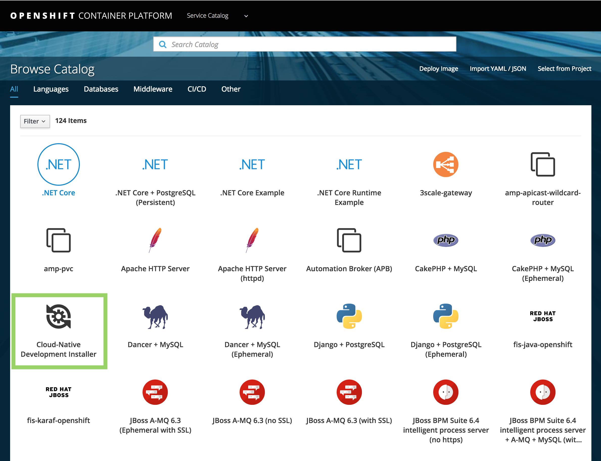

Environment Installer
=========

The provided Ansible Playbook Bundle (APB) automates preparing an OpenShift cluster 
by deploying required services (lab instructions, Gogs, Nexus, etc).

# Build and Deploy the APB on Openshift

## Prepare (Only if you change the apb.yml file)
First update the `com.redhat.apb.spec` LABEL from the Dockerfile file with a base64 encoded version of apb.yml
```bash
$ git clone https://github.com/<your username>/cloud-native-workshop-apb.git
$ cd cloud-native-workshop-apb
$ sed -i '.bak' "s/LABEL \"com.redhat.apb.spec\"=.*/LABEL \"com.redhat.apb.spec\"=\"$(cat apb.yml | base64)\"/g" Dockerfile
$ git commit
$ git push
```

```dockerfile
# Dockerfile
FROM ansibleplaybookbundle/apb-base

LABEL "com.redhat.apb.spec"="dmVyc2lvbjogMS4wCm5hbWU6IG15LXRlc3Qt..."

COPY playbooks /opt/apb/project
ADD requirements.yml /opt/apb/project/requirements.yml
RUN ansible-galaxy install -r /opt/apb/project/requirements.yml -f
RUN chmod -R g=u /opt/{ansible,apb}
USER apb
```

## Build and Deploy on Openshift
```bash
$ oc new-build https://github.com/<your username>/cloud-native-workshop-apb \
    --name=cloud-native-workshop-apb \
    -n openshift
```

Visiting the OpenShift console UI will now display the new Ansible Playbook Bundle named "Cloud-Native Development Installer" in the catalog under the **_All_** tab and **_Other_** tab.



Or if you have Ansible installed locally, you can also run the Ansilbe playbooks directly on your machine:

## Build locally
```
oc login
oc new-project lab-infra

ansible-galaxy install -r requirements.yml -f
ansible-playbook -vvv playbooks/provision.yml \
       -e namespace=$(oc project -q) \
       -e openshift_token=$(oc whoami -t) \
       -e openshift_master_url=$(oc whoami --show-server)
``` 
